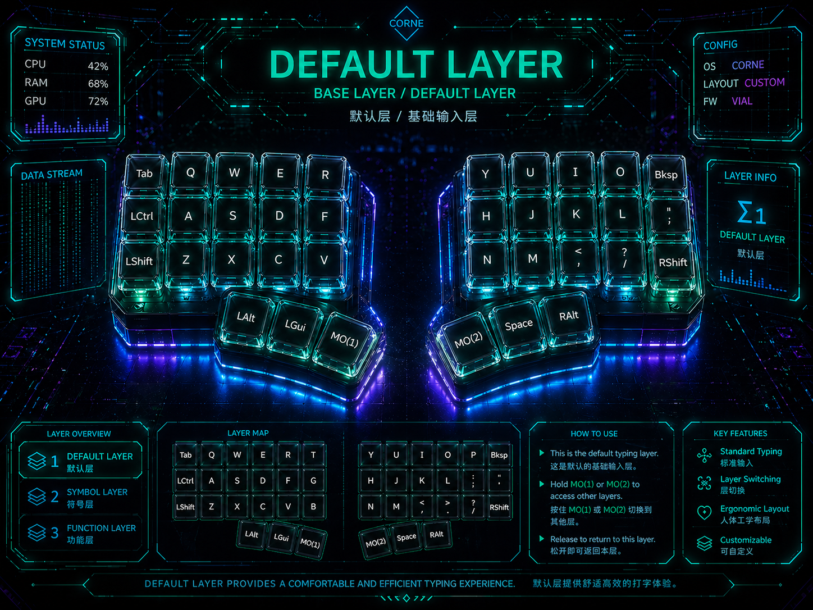
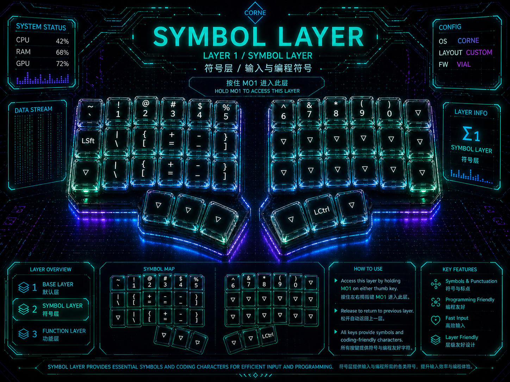
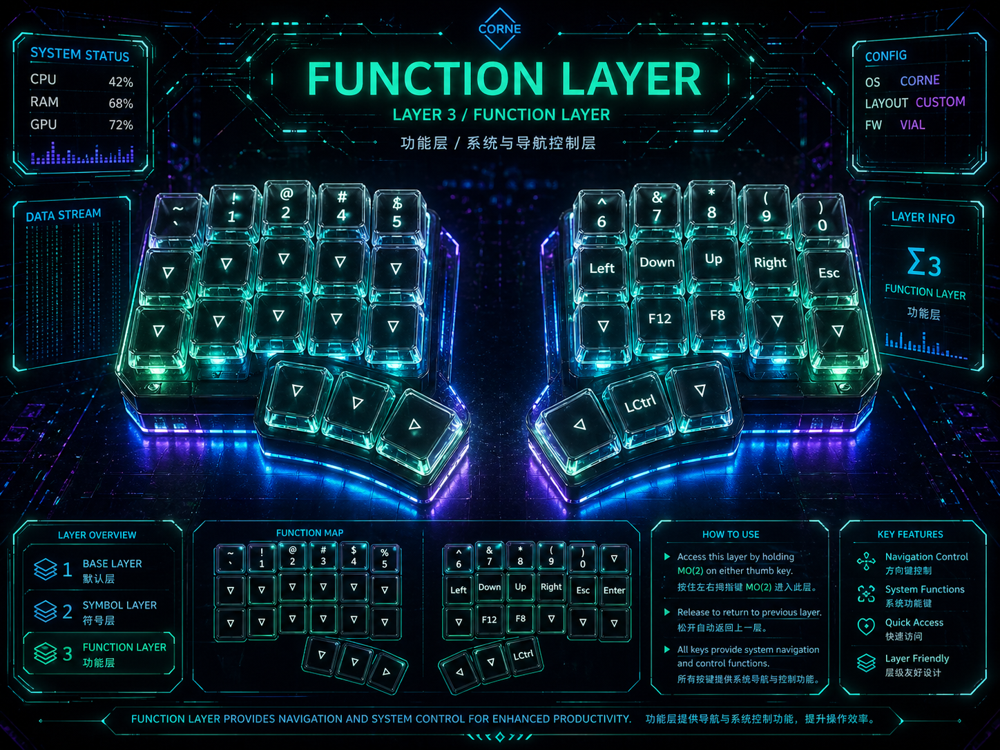

# Corne Fast Typing Layout

[中文](README.md)

This is my personal Corne layout, shared as a three-layer setup focused on fast typing, low finger travel, and efficient layer switching on a 42-key split keyboard.

The idea is simple: the default layer handles regular typing, the symbol layer keeps punctuation and programming symbols close, and the function layer provides numbers, navigation, and system controls. Most actions are reached by holding a thumb layer key, so the fingers can stay near the home area.

Layer access is also designed around hand-side consistency: the side that holds the layer key should feel like the side that gets expanded. The left-side layer key focuses on left-hand symbol access, while the right-side layer key focuses on right-hand numbers, navigation, and function controls. This keeps temporary one-handed operation more intuitive.

For typing speed and predictability, this layout only uses three practical input layers. It does not rely on Tap Dance or Combo. Tap Dance can slow down fast typing because the firmware has to decide whether a key is tapped, held, or tapped multiple times. Combo can become easy to trigger by accident when typing quickly. This layout favors direct, stable, low-latency layer access.

## Layout Goals

- **Fast typing**: frequent keys such as letters, space, backspace, and modifiers are easy to reach.
- **Three practical layers**: default, symbol, and function layers cover daily typing workflows.
- **Thumb-driven layer access**: `MO(1)` and `MO(2)` provide quick momentary access to extra layers.
- **Side-aware layer access**: the hand that holds a layer key gets a useful expansion on that side.
- **Programming friendly**: brackets, operators, numbers, and arrows are grouped for efficient coding.
- **No Tap Dance / Combo**: avoids timing delays and accidental triggers during fast typing.
- **Vial friendly**: the layout is provided as `layout.vil` for Vial/VIA-style workflows.

## Layer Overview

### 1. Default Layer

The default layer is the main typing layer. Letters are arranged across both halves, with frequently used thumb keys such as `LAlt`, `LGui`, `MO(1)`, `MO(2)`, `Space`, and `RAlt`.

Highlights:

- Main alpha input stays on the base layer.
- Hold `MO(1)` to access the symbol layer.
- Hold `MO(2)` to access the function layer.
- Layer keys are split by hand side so the triggering hand gets a natural local expansion.
- Backspace, space, and modifiers are placed for quick access.

### 2. Symbol Layer

The symbol layer is designed for punctuation, brackets, and programming symbols. Hold `MO(1)` to access it, then release to return to the default layer.

Highlights:

- The top row provides common shifted symbols such as `! @ # $ % ^ & * ( )`.
- Brackets, backslash, plus, minus, and equals are grouped on the left side.
- Useful for coding, Markdown, shell commands, and general punctuation.

### 3. Function Layer

The function layer provides numbers, arrow keys, Esc, Enter, and personal high-frequency function keys. Hold `MO(2)` to access it.

The number layout intentionally follows the feel of a standard keyboard number row, placing numbers near the columns that correspond to the default-layer `QWER` area. This lowers the migration cost from a regular keyboard to Corne because the number positions still connect to familiar muscle memory.

Highlights:

- Numbers are grouped on the top row, close to the relative positions of a standard number row.
- Arrow keys are placed on the right-hand home area for fast text navigation.
- `F12` is my input-method switch key, and `F8` is my tmux prefix, so both are placed on this layer for quick access.
- `Esc`, `Enter`, and other editing controls are kept on the function layer instead of crowding the default layer.
- Useful for editing, window control, and system shortcuts.

## Speed Trade-Offs

The goal is not to pack every advanced feature into 42 keys. The goal is to keep frequent input paths direct and predictable.

- No Tap Dance: fast typing does not have to wait for tap/hold/multi-tap decisions.
- No Combo: fewer accidental triggers when adjacent keys are pressed quickly.
- Only 3 layers: default, symbol, and function layers cover the main workflow with lower memory overhead.

## How to Use

1. Connect your Corne keyboard.
2. Open [Vial Web](https://vial.rocks/).
3. Connect the device in the page.
4. Choose `File` -> `Load saved layout`.
5. Load `layout.vil` from this repository.
6. Adjust the layout based on your hands, typing habits, and operating system shortcuts.
